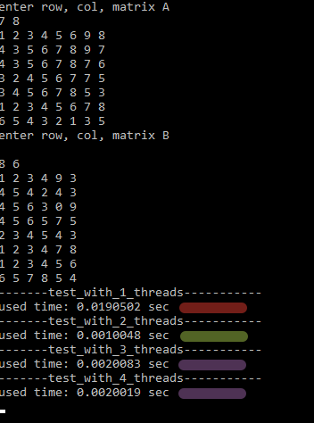

# NORA
Project for high-level programming 

# Task:
Made multy-threading multiplication of two matrix
# Result of work:
On my HP(intel core i5) there is appresiable differences beetween 1 or 2 threads, you can see on screen. 
3 or 4 threads doesn't perform too effectively. Maybe it's because i  have 2 kernels on my laptop

